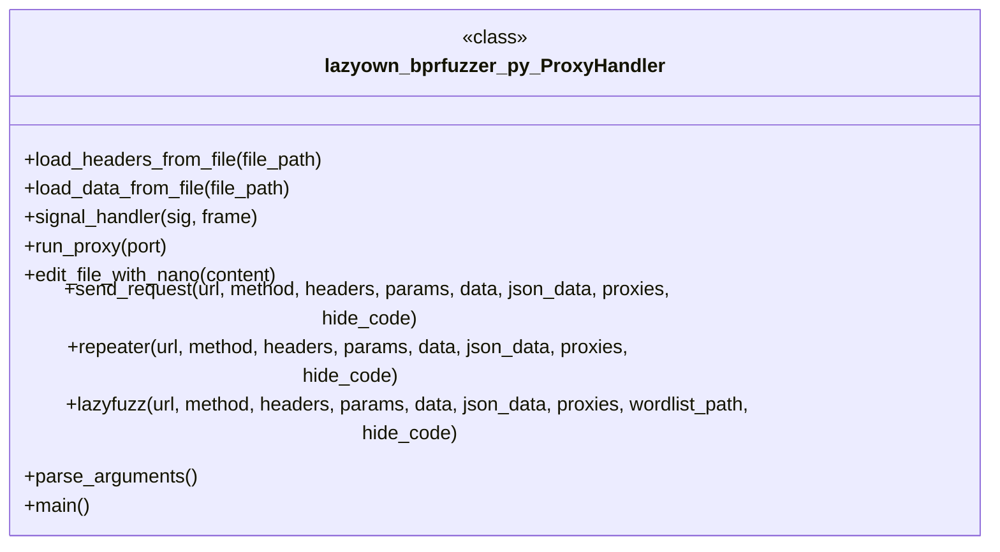

# Polyglot Codebase Knowledge Graph

> Generated offline by **readmenator**. Supports C, C++, Python, Go, Rust, JS/TS, Java, C#, Shell, PHP, Dart, GDScript, Nim, ASM, Ruby, Swift, Kotlin, Scala, Lua, Elixir.
> No LLMs. No tokens. Pure static analysis. See more [here](https://github.com/grisuno/ReadMenator)

**Total Files Parsed:** 3 | **Total Symbols Extracted:** 18 | **Total Imports:** 11
 | **Resolved Imports:** 1

<!-- ranking_model: v1.0 | weights: {ppr:0.45,auth:0.2,test:0.15,doc:0.1,fresh:0.1} | alpha:0.85 | commit:75d209c | date:2026-07-18 -->


## Table of Contents

1. [Statistics Dashboard](#statistics-dashboard)
2. [Architectural Layers](#architectural-layers)
3. [Ranked Context](#ranked-context)
4. [God Nodes](#god-nodes)
5. [Community Analysis](#community-analysis)
6. [Suggested Questions](#suggested-questions)
7. [Taint Propagation Map](#taint-propagation-map)
8. [Hotspot Analysis](#hotspot-analysis)
9. [Change Impact Analysis](#change-impact-analysis)
10. [Suggested Linting Rules](#suggested-linting-rules)
11. [Orphans](#orphans)
12. [Query Recipes](#query-recipes)
13. [Structural Knowledge Map](#structural-knowledge-map)
14. [UML Class Diagram](#uml-class-diagram)
15. [Code Property Graph](#code-property-graph)
16. [Architecture Reference](#architecture-reference)
    - [PY (2 files)](#py-2-files)
    - [SH (1 files)](#sh-1-files)

---

## Statistics Dashboard

| Metric | Value |
|--------|-------|
| Total Files | 3 |
| Total Symbols | 18 |
| Total Imports | 11 |
| Call Edges | 133 |
| Inheritance Edges | 1 |
| Languages | 2 |
| Avg Symbols/File | 6.0 |
| Avg Imports/File | 3.7 |
| Resolved Imports | 1 |

### Top Files by Import Count (Fan-Out)

| File | Imports | Symbols | Language |
|------|---------|---------|----------|
| `lazyown_bprfuzzer.py` | 9 | 14 | py |
| `app.py` | 2 | 4 | py |

---

## Architectural Layers

Auto-detected from path patterns, naming conventions, and imported frameworks.

| Layer | Files |
|-------|-------|
| utility | 2 |
| presentation | 1 |

### presentation

- `app.py` (py, 4 symbols)

### utility

- `install.sh` (sh, 0 symbols)
- `lazyown_bprfuzzer.py` (py, 14 symbols)

---

## Ranked Context

Files ranked by composite score for the current query context. The ranking combines Personalized PageRank (query relevance), global authority, test coverage, documentation coverage, and code freshness. Model: v1.0.

| Rank | File | Composite | PPR | Authority | Test | Doc |
|------|------|-----------|-----|-----------|------|-----|
| 1 | `lazyown_bprfuzzer.py` | 0.4576 | 0.6491 | 0.6491 | 0.00 | 0.36 |
| 2 | `app.py` | 0.2531 | 0.3509 | 0.3509 | 0.00 | 0.25 |
| 3 | `install.sh` | 0.0000 | 0.0000 | 0.0000 | 0.00 | 0.00 |

---

## God Nodes

Most architecturally central files ranked by combined import/export degree and symbol richness.

| File | Score | Connections | PageRank |
|------|-------|-------------|----------|
| `lazyown_bprfuzzer.py` | 3.4 | | 0.6491 |
| `app.py` | 2.4 | | 0.3509 |
| `install.sh` | 0.0 | | 0.0000 |

---

## Community Analysis

Files grouped by import-based community detection. Cohesion measures how tightly connected each community is internally.

### root (Cohesion: 1.00)

**2 files** in this community:

- `app.py` (py, 4 symbols)
- `lazyown_bprfuzzer.py` (py, 14 symbols)

---

## Suggested Questions

Auto-generated exploration prompts based on graph structure:

- What does lazyown_bprfuzzer.py depend on, and what depends on it? (1 connections)
- What does app.py depend on, and what depends on it? (1 connections)
- What does install.sh depend on, and what depends on it? (0 connections)
- What is ProxyHandler in lazyown_bprfuzzer.py and how is it used?
- What is the overall architecture of this codebase?

---

## Taint Propagation Map

Taint analysis traces how dangerous imports propagate through the codebase via transitive dependencies. Source files import dangerous modules directly; sink files receive the danger indirectly.

**Taint Sources:** 1 | **Taint Sinks:** 1 | **Propagation Paths:** 2

- `lazyown_bprfuzzer.py` imports `requests` (0 hop to `lazyown_bprfuzzer.py`) [medium]
  Path: lazyown_bprfuzzer.py
- `lazyown_bprfuzzer.py` imports `subprocess` (0 hop to `lazyown_bprfuzzer.py`) [high]
  Path: lazyown_bprfuzzer.py

---

## Hotspot Analysis

Files ranked by combined complexity (symbol count) and centrality (connection count). High-scoring files are architecturally critical and may need refactoring attention.

| File | Complexity | Centrality | Combined | Symbols | Connections |
|------|-----------|------------|----------|---------|-------------|
| `lazyown_bprfuzzer.py` | 1.000 | 1.000 | 1.000 | 14 | 10 |
| `app.py` | 0.286 | 0.300 | 0.294 | 4 | 3 |
| `install.sh` | 0.000 | 0.000 | 0.000 | 0 | 0 |

---

## Change Impact Analysis

Files sorted by how many other files would be affected if they changed. High-impact files should be changed with caution.

| File | Direct Dependents | Transitive Dependents | Total Impact |
|------|------------------|----------------------|--------------|
| `lazyown_bprfuzzer.py` | 1 | 0 | 1 |
| `app.py` | 0 | 0 | 0 |
| `install.sh` | 0 | 0 | 0 |

---

## Suggested Linting Rules

Automatically suggested linting and security rules based on patterns detected in the codebase. These can be exported as Semgrep rules using the `--export-rules` flag.

| Rule ID | Severity | Description | Language | Matches |
|---------|----------|-------------|----------|---------|
| `RM001` | info | Large number of functions in py: 17 total | py | 17 |
| `RM002` | info | Print statement found (consider logging instead) | python | 20 |

---

## Orphans

Files with no documentation or low connectivity. These are candidates for documentation investment or cleanup.

- `install.sh` (0 symbols, no doc)

---

## Query Recipes

Example queries you can run against this knowledge base using the ranking engine:

```
# Find files most relevant to a concept
readmenator query "Where is the import resolver implemented?"

# Rank files by relevance to a topic
readmenator query "How does documentation generation work?"

# Explain why a file ranks highly
readmenator query "explain readmenator/_documentation.py"

# Trace dependency paths with ranked context
readmenator query "path from CLI to exporter"
```

The ranking model uses the following signals:

- **Personalized PageRank** (45% weight): query-specific relevance via seed propagation
- **Global Authority** (20% weight): structural importance via standard PageRank
- **Test Coverage** (15% weight): fraction of symbols referenced in test files
- **Doc Coverage** (10% weight): presence of docstrings and file-level docs
- **Freshness** (10% weight): recent modification activity

Results include score decomposition and justification paths for each ranked item.

---

## Structural Knowledge Map

```mermaid
graph TD
    classDef mod fill:#1e1e1e,stroke:#ff6666,stroke-width:2px,color:#fff;
    classDef cls fill:#2d2d2d,stroke:#4ec9b0,stroke-width:2px,color:#fff;
    classDef fn fill:#333,stroke:#dcdcaa,stroke-width:1px,color:#dcdcaa;
    classDef ext fill:#111,stroke:#666,stroke-dasharray:5 5,color:#aaa;
    subgraph community_0 ["root"]
    lazyown_bprfuzzer_py["lazyown_bprfuzzer.py (py)"]
    class lazyown_bprfuzzer_py mod;
    lazyown_bprfuzzer_py_load_headers_from_file["load_headers_from_file"]
    class lazyown_bprfuzzer_py_load_headers_from_file fn;
    lazyown_bprfuzzer_py --> lazyown_bprfuzzer_py_load_headers_from_file
    lazyown_bprfuzzer_py_load_data_from_file["load_data_from_file"]
    class lazyown_bprfuzzer_py_load_data_from_file fn;
    lazyown_bprfuzzer_py --> lazyown_bprfuzzer_py_load_data_from_file
    lazyown_bprfuzzer_py_signal_handler["signal_handler"]
    class lazyown_bprfuzzer_py_signal_handler fn;
    lazyown_bprfuzzer_py --> lazyown_bprfuzzer_py_signal_handler
    lazyown_bprfuzzer_py_ProxyHandler["ProxyHandler"]
    class lazyown_bprfuzzer_py_ProxyHandler cls;
    lazyown_bprfuzzer_py --> lazyown_bprfuzzer_py_ProxyHandler
    lazyown_bprfuzzer_py_run_proxy["run_proxy"]
    class lazyown_bprfuzzer_py_run_proxy fn;
    lazyown_bprfuzzer_py --> lazyown_bprfuzzer_py_run_proxy
    app_py["app.py (py)"]
    class app_py mod;
    install_sh["install.sh (sh)"]
    class install_sh mod;
    end
    app_py -- resolved_imports --> lazyown_bprfuzzer_py
    ext_flask["flask"]
    class ext_flask ext;
    app_py -.->|imports| ext_flask
    ext_lazyown_bprfuzzer["lazyown_bprfuzzer"]
    class ext_lazyown_bprfuzzer ext;
    app_py -.->|imports| ext_lazyown_bprfuzzer
    ext_argparse["argparse"]
    class ext_argparse ext;
    lazyown_bprfuzzer_py -.->|imports| ext_argparse
    ext_json["json"]
    class ext_json ext;
    lazyown_bprfuzzer_py -.->|imports| ext_json
    ext_requests["requests"]
    class ext_requests ext;
    lazyown_bprfuzzer_py -.->|imports| ext_requests
    ext_signal["signal"]
    class ext_signal ext;
    lazyown_bprfuzzer_py -.->|imports| ext_signal
    ext_subprocess["subprocess"]
    class ext_subprocess ext;
    lazyown_bprfuzzer_py -.->|imports| ext_subprocess
    ext_tempfile["tempfile"]
    class ext_tempfile ext;
    lazyown_bprfuzzer_py -.->|imports| ext_tempfile
    ext_threading["threading"]
    class ext_threading ext;
    lazyown_bprfuzzer_py -.->|imports| ext_threading
    ext_os["os"]
    class ext_os ext;
    lazyown_bprfuzzer_py -.->|imports| ext_os
    ext_http_server["http.server"]
    class ext_http_server ext;
    lazyown_bprfuzzer_py -.->|imports| ext_http_server
```



---

## UML Class Diagram

Auto-generated Mermaid class diagram from parsed class-level symbols. Shows classes, structs, interfaces, traits, and their methods with inheritance and dependency relationships.



---

## Code Property Graph

Machine-readable Code Property Graph (CPG) in JSON-LD format. This block allows AI agents to parse the full structural graph without additional file reads. Compatible with GraphRAG pipelines.

```json
{"@context": "https://schema.org", "analysis": {"communities": [{"cohesion": 1.0, "id": 0, "label": "root", "size": 2}], "god_nodes": [{"node_id": "lazyown_bprfuzzer.py", "score": 3.4}, {"node_id": "app.py", "score": 2.4}, {"node_id": "install.sh", "score": 0.0}], "surprising_connections": []}, "edges": [{"confidence": "EXTRACTED", "relation": "imports", "source": "app.py", "target": "flask"}, {"confidence": "EXTRACTED", "relation": "imports", "source": "app.py", "target": "lazyown_bprfuzzer"}, {"confidence": "EXTRACTED", "relation": "imports", "source": "lazyown_bprfuzzer.py", "target": "argparse"}, {"confidence": "EXTRACTED", "relation": "imports", "source": "lazyown_bprfuzzer.py", "target": "json"}, {"confidence": "EXTRACTED", "relation": "imports", "source": "lazyown_bprfuzzer.py", "target": "requests"}, {"confidence": "EXTRACTED", "relation": "imports", "source": "lazyown_bprfuzzer.py", "target": "signal"}, {"confidence": "EXTRACTED", "relation": "imports", "source": "lazyown_bprfuzzer.py", "target": "subprocess"}, {"confidence": "EXTRACTED", "relation": "imports", "source": "lazyown_bprfuzzer.py", "target": "tempfile"}, {"confidence": "EXTRACTED", "relation": "imports", "source": "lazyown_bprfuzzer.py", "target": "threading"}, {"confidence": "EXTRACTED", "relation": "imports", "source": "lazyown_bprfuzzer.py", "target": "os"}, {"confidence": "EXTRACTED", "relation": "imports", "source": "lazyown_bprfuzzer.py", "target": "http.server"}, {"confidence": "EXTRACTED", "relation": "resolved_imports", "source": "app.py", "target": "lazyown_bprfuzzer.py"}], "generator": "readmenator", "metadata": {"edge_count": 146, "file_count": 3, "language_count": 2, "symbol_count": 18}, "nodes": [{"doc": "_*_ coding: utf8 _*_", "id": "app.py", "kind": "module", "label": "app.py", "language": "py", "sha256": "f3145204eaefd018", "symbol_count": 4, "symbols": [{"kind": "function", "line": 19, "name": "index", "signature": "def index()"}, {"kind": "function", "line": 23, "name": "intercept", "signature": "def intercept()"}, {"kind": "function", "line": 52, "name": "scan", "signature": "def scan()"}, {"kind": "function", "line": 68, "name": "repeater", "signature": "def repeater()"}]}, {"id": "install.sh", "kind": "module", "label": "install.sh", "language": "sh", "sha256": "c907d80fd6734993", "symbol_count": 0, "symbols": []}, {"doc": "_*_ coding: utf8 _*_", "id": "lazyown_bprfuzzer.py", "kind": "module", "label": "lazyown_bprfuzzer.py", "language": "py", "sha256": "ef06c8268c3fbc25", "symbol_count": 14, "symbols": [{"kind": "function", "line": 59, "name": "load_headers_from_file", "signature": "def load_headers_from_file(file_path)"}, {"kind": "function", "line": 64, "name": "load_data_from_file", "signature": "def load_data_from_file(file_path)"}, {"kind": "function", "line": 69, "name": "signal_handler", "signature": "def signal_handler(sig, frame)"}, {"kind": "class", "line": 76, "name": "ProxyHandler", "signature": "class ProxyHandler(BaseHTTPRequestHandler)"}, {"kind": "method", "line": 99, "name": "run_proxy", "signature": "def run_proxy(port)"}, {"kind": "method", "line": 105, "name": "edit_file_with_nano", "signature": "def edit_file_with_nano(content)"}, {"doc": "Envía una solicitud HTTP y devuelve la respuesta.", "kind": "method", "line": 114, "name": "send_request", "signature": "def send_request(url, method, headers, params, data, json_data, proxies, hide_code)"}, {"doc": "Funcionalidad de Repeater que permite enviar solicitudes múltiples veces con posibilidad de modificación.", "kind": "method", "line": 135, "name": "repeater", "signature": "def repeater(url, method, headers, params, data, json_data, proxies, hide_code)"}, {"doc": "Funcionalidad de fuzzing que reemplaza LAZYFUZZ con palabras de una wordlist.", "kind": "method", "line": 165, "name": "lazyfuzz", "signature": "def lazyfuzz(url, method, headers, params, data, json_data, proxies, wordlist_path, hide_code)"}, {"doc": "Parsear los argumentos de la línea de comandos.", "kind": "method", "line": 210, "name": "parse_arguments", "signature": "def parse_arguments()"}, {"kind": "method", "line": 231, "name": "main", "signature": "def main()"}, {"kind": "method", "line": 77, "name": "do_GET", "signature": "def do_GET(self)"}, {"kind": "method", "line": 80, "name": "do_POST", "signature": "def do_POST(self)"}, {"kind": "method", "line": 83, "name": "_handle_request", "signature": "def _handle_request(self, method)"}]}], "type": "CodePropertyGraph", "version": "1.0"}
```

---

## Architecture Reference

### PY (2 files)

#### `app.py`
**Path:** `app.py`
**File Doc:** *_*_ coding: utf8 _*_*

**Functions:**
- `index` (line 19) `def index()`
- `intercept` (line 23) `def intercept()`
- `scan` (line 52) `def scan()`
- `repeater` (line 68) `def repeater()`

#### `lazyown_bprfuzzer.py`
**Path:** `lazyown_bprfuzzer.py`
**File Doc:** *_*_ coding: utf8 _*_*

**Classes:**
- `ProxyHandler` (line 76) `class ProxyHandler(BaseHTTPRequestHandler)`

**Functions:**
- `load_headers_from_file` (line 59) `def load_headers_from_file(file_path)`
- `load_data_from_file` (line 64) `def load_data_from_file(file_path)`
- `signal_handler` (line 69) `def signal_handler(sig, frame)`

**Methods:**
- `run_proxy` (line 99) `def run_proxy(port)`
- `edit_file_with_nano` (line 105) `def edit_file_with_nano(content)`
- `send_request` (line 114) `def send_request(url, method, headers, params, data, json_data, proxies, hide_code)` - *Envía una solicitud HTTP y devuelve la respuesta.*
- `repeater` (line 135) `def repeater(url, method, headers, params, data, json_data, proxies, hide_code)` - *Funcionalidad de Repeater que permite enviar solicitudes múltiples veces con posibilidad de modificación.*
- `lazyfuzz` (line 165) `def lazyfuzz(url, method, headers, params, data, json_data, proxies, wordlist_path, hide_code)` - *Funcionalidad de fuzzing que reemplaza LAZYFUZZ con palabras de una wordlist.*
- `parse_arguments` (line 210) `def parse_arguments()` - *Parsear los argumentos de la línea de comandos.*
- `main` (line 231) `def main()`
- `do_GET` (line 77) `def do_GET(self)`
- `do_POST` (line 80) `def do_POST(self)`
- `_handle_request` (line 83) `def _handle_request(self, method)`

### SH (1 files)

#### `install.sh`
**Path:** `install.sh`

*No symbols extracted*
