# Polyglot Codebase Knowledge Graph

> Generated offline by **readmenator**. Supports C, C++, Python, Go, Rust, JS/TS, Java, C#, Shell, PHP, Dart, GDScript, Nim, ASM.
> No LLMs. No tokens. Pure static analysis. See more [here](https://github.com/grisuno/ReadMenator)

**Total Files Parsed:** 3 | **Total Symbols Extracted:** 18 | **Total Imports:** 11

## Structural Knowledge Map

```mermaid
graph TD
    classDef mod fill:#1e1e1e,stroke:#ff6666,stroke-width:2px,color:#fff;
    classDef cls fill:#2d2d2d,stroke:#4ec9b0,stroke-width:2px,color:#fff;
    classDef fn fill:#333,stroke:#dcdcaa,stroke-width:1px,color:#dcdcaa;
    classDef ext fill:#111,stroke:#666,stroke-dasharray: 5 5,color:#aaa;
    lazyown_bprfuzzer_py["lazyown_bprfuzzer.py (py)"]
    class lazyown_bprfuzzer_py mod;
    lazyown_bprfuzzer_py_load_headers_from_file["load_headers_from_file"]
    class lazyown_bprfuzzer_py_load_headers_from_file fn;
    lazyown_bprfuzzer_py --> lazyown_bprfuzzer_py_load_headers_from_file
    lazyown_bprfuzzer_py_load_data_from_file["load_data_from_file"]
    class lazyown_bprfuzzer_py_load_data_from_file fn;
    lazyown_bprfuzzer_py --> lazyown_bprfuzzer_py_load_data_from_file
    lazyown_bprfuzzer_py_signal_handler["signal_handler"]
    class lazyown_bprfuzzer_py_signal_handler fn;
    lazyown_bprfuzzer_py --> lazyown_bprfuzzer_py_signal_handler
    lazyown_bprfuzzer_py_ProxyHandler["ProxyHandler"]
    class lazyown_bprfuzzer_py_ProxyHandler cls;
    lazyown_bprfuzzer_py --> lazyown_bprfuzzer_py_ProxyHandler
    lazyown_bprfuzzer_py_run_proxy["run_proxy"]
    class lazyown_bprfuzzer_py_run_proxy fn;
    lazyown_bprfuzzer_py --> lazyown_bprfuzzer_py_run_proxy
    app_py["app.py (py)"]
    class app_py mod;
    app_py_index["index"]
    class app_py_index fn;
    app_py --> app_py_index
    app_py_intercept["intercept"]
    class app_py_intercept fn;
    app_py --> app_py_intercept
    app_py_scan["scan"]
    class app_py_scan fn;
    app_py --> app_py_scan
    app_py_repeater["repeater"]
    class app_py_repeater fn;
    app_py --> app_py_repeater
    install_sh["install.sh (sh)"]
    class install_sh mod;
    ext_flask["flask"]
    class ext_flask ext;
    app_py -.->|imports| ext_flask
    ext_lazyown_bprfuzzer["lazyown_bprfuzzer"]
    class ext_lazyown_bprfuzzer ext;
    app_py -.->|imports| ext_lazyown_bprfuzzer
    ext_argparse["argparse"]
    class ext_argparse ext;
    lazyown_bprfuzzer_py -.->|imports| ext_argparse
    ext_json["json"]
    class ext_json ext;
    lazyown_bprfuzzer_py -.->|imports| ext_json
    ext_requests["requests"]
    class ext_requests ext;
    lazyown_bprfuzzer_py -.->|imports| ext_requests
    ext_signal["signal"]
    class ext_signal ext;
    lazyown_bprfuzzer_py -.->|imports| ext_signal
    ext_subprocess["subprocess"]
    class ext_subprocess ext;
    lazyown_bprfuzzer_py -.->|imports| ext_subprocess
    ext_tempfile["tempfile"]
    class ext_tempfile ext;
    lazyown_bprfuzzer_py -.->|imports| ext_tempfile
    ext_threading["threading"]
    class ext_threading ext;
    lazyown_bprfuzzer_py -.->|imports| ext_threading
    ext_os["os"]
    class ext_os ext;
    lazyown_bprfuzzer_py -.->|imports| ext_os
    ext_http_server["http.server"]
    class ext_http_server ext;
    lazyown_bprfuzzer_py -.->|imports| ext_http_server
```

---

## Architecture Reference

### PY (2 files)

#### `app.py`
**Path:** `app.py`

**Functions:**
- `index` (line 19) `def index()`
- `intercept` (line 23) `def intercept()`
- `scan` (line 52) `def scan()`
- `repeater` (line 68) `def repeater()`

#### `lazyown_bprfuzzer.py`
**Path:** `lazyown_bprfuzzer.py`

**Classes:**
- `ProxyHandler` (line 76) `class ProxyHandler(BaseHTTPRequestHandler)`

**Functions:**
- `load_headers_from_file` (line 59) `def load_headers_from_file(file_path)`
- `load_data_from_file` (line 64) `def load_data_from_file(file_path)`
- `signal_handler` (line 69) `def signal_handler(sig, frame)`
- `run_proxy` (line 99) `def run_proxy(port)`
- `edit_file_with_nano` (line 105) `def edit_file_with_nano(content)`
- `send_request` (line 114) `def send_request(url, method, headers, params, data, json_data, proxies, hide_code)` - *Envía una solicitud HTTP y devuelve la respuesta.*
- `repeater` (line 135) `def repeater(url, method, headers, params, data, json_data, proxies, hide_code)` - *Funcionalidad de Repeater que permite enviar solicitudes múltiples veces con posibilidad de modificación.*
- `lazyfuzz` (line 165) `def lazyfuzz(url, method, headers, params, data, json_data, proxies, wordlist_path, hide_code)` - *Funcionalidad de fuzzing que reemplaza LAZYFUZZ con palabras de una wordlist.*
- `parse_arguments` (line 210) `def parse_arguments()` - *Parsear los argumentos de la línea de comandos.*
- `main` (line 231) `def main()`
- `do_GET` (line 77) `def do_GET(self)`
- `do_POST` (line 80) `def do_POST(self)`
- `_handle_request` (line 83) `def _handle_request(self, method)`

### SH (1 files)

#### `install.sh`
**Path:** `install.sh`

*No symbols extracted*
